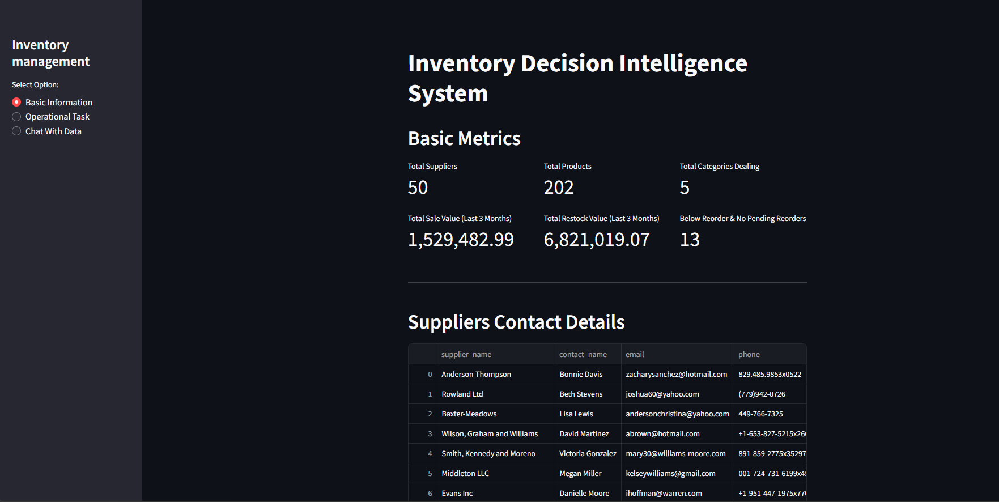
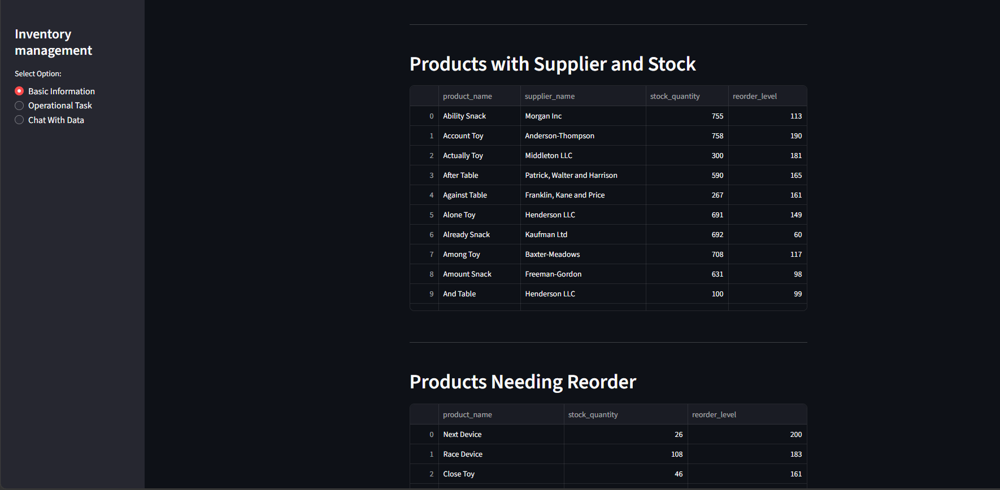
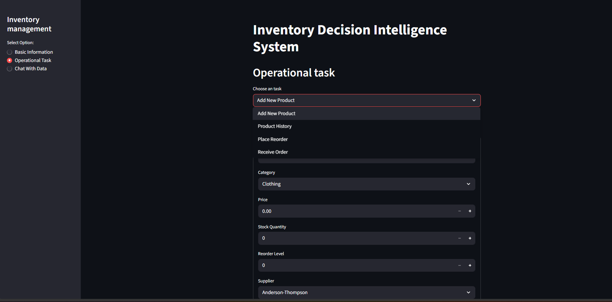
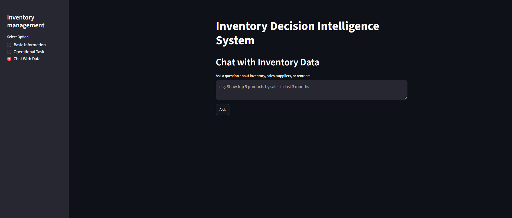
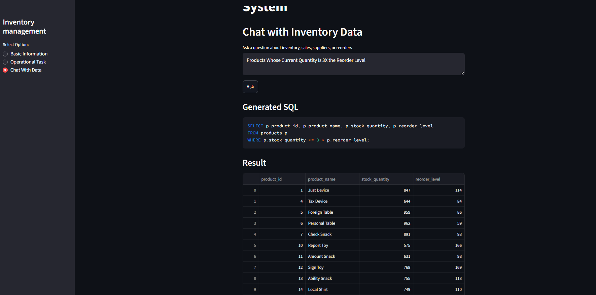
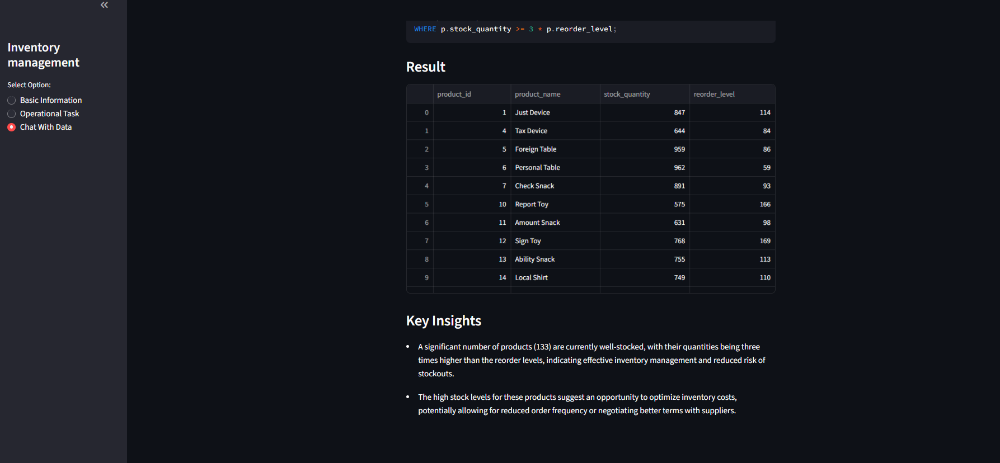

# Inventory Decision Intelligence System

AI-powered inventory analytics and operational management platform built using PostgreSQL, Python, Streamlit, and OpenAI GPT APIs.

This project helps users monitor inventory operations, manage products and reorders, and interact with the database using natural language questions without writing SQL queries.

---

# Features

## Basic Analytics Dashboard
- Inventory KPIs and operational metrics
- Supplier and stock information
- Reorder monitoring
- Live database-driven insights

## Operational Tasks
- Add new products
- Place reorder requests
- Receive orders
- View product history

## AI-Powered Chat With Data
- Ask questions in plain English
- GPT converts natural language into SQL queries
- Generated SQL is displayed for transparency
- Read-only SQL safety validation implemented

---

# Tech Stack

- Python
- PostgreSQL
- Streamlit
- OpenAI GPT API
- Pandas
- SQL

---

# Dashboard Preview

## Basic Metrics Dashboard

---

## Operational Management

---

## AI Chat Interface

---

## AI Generated SQL and result

---

## AI-Based Inventory Insights

---

# Key Highlights

- Full-stack inventory management application
- Natural language to SQL conversion using GPT
- SQL safety enforcement to prevent destructive queries
- Interactive Streamlit dashboard
- Real-time PostgreSQL integration
- Inventory analytics and operational workflows